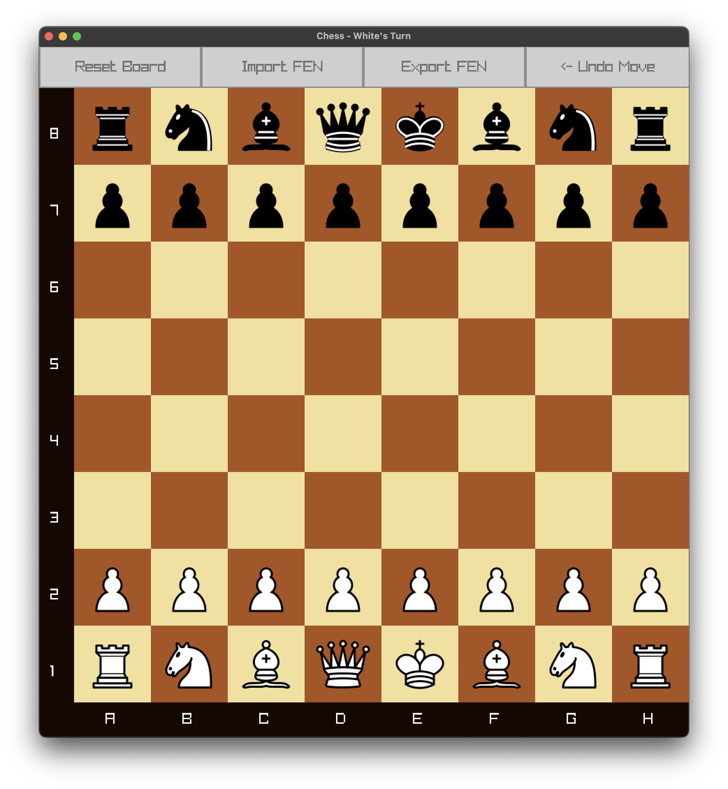

# Chess Game

A fully-featured chess game built in C using raylib for graphics and GUI elements. Play chess with all standard rules including castling, en passant, and proper checkmate detection.



## Building from Source

### Prerequisites

- C compiler (GCC/Clang)
- Make

### Build Instructions

1. Clone the repository:
```bash
git clone https://github.com/mdbrnd/chess.git
cd chess
```

2. Build the game:
```bash
make
```
The build system will automatically detect your operating system and use the appropriate compiler and library flags.

3. Run the game
```bash
./chess
```

## Features

- **Complete chess rule implementation**
- **Graphical user interface** with piece movement visualization
- **Move validation and legal move highlighting**
- **Support for special moves**:
  - Castling (kingside and queenside)
  - En passant captures
  - Pawn promotion
- **Game state tracking**:
  - Checkmate detection
  - Stalemate detection
  - Move history
- **FEN notation support (*mostly; no castling/en passant import*)**:
- **Undo move functionality**
- **Cross-platform support** (Windows, Linux, macOS)

### Platform-specific Notes

- **Windows**: Uses GCC with MinGW, builds `chess.exe`
- **Linux**: Uses GCC, requires OpenGL and X11 development libraries
- **macOS**: Uses Clang, requires Cocoa and OpenGL frameworks (should be installed by default)

**Note for Linux Users:** `lib/linux/libraylib.a` might not work as it was compiled on a macOS machine. To compile raylib, follow [Working on GNU Linux](https://github.com/raysan5/raylib/wiki/Working-on-GNU-Linux)